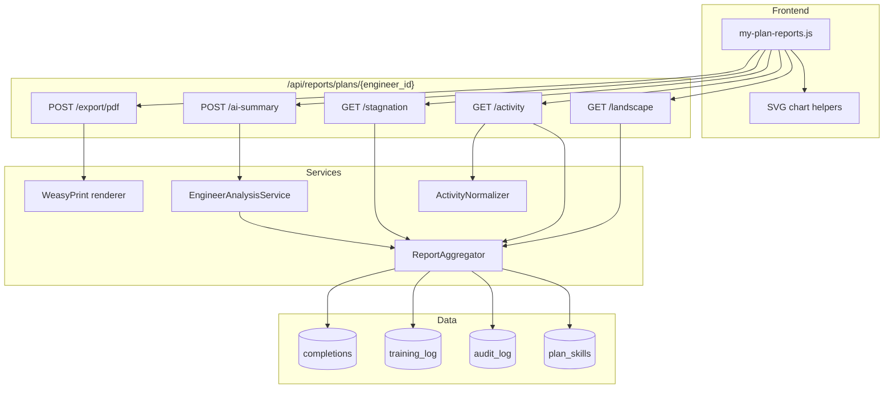

# My Plan Reporting Module — Design Proposal

> **Status:** Design review (no implementation)  
> **Audience:** Product / engineering review before build  
> **Last updated:** June 2026

---

## 1. Executive Summary

MatrixPro already has **partial** reporting for My Plan: a sidebar **Reporting** button opens a modal with **Change Logs** and **Skills Overview** tabs backed by `/api/export/plans/{id}/…` endpoints and WeasyPrint PDF export. However, this implementation is **incomplete relative to the requested spec** and has **frontend/API shape mismatches** that cause empty or broken previews.

This proposal defines a **unified Reporting experience** with four report types, shared filters, live preview, and PDF export — reusing the rich data aggregation in `backend/app/routers/reporting.py` (`_collect_engineer_data`) and the My Team AI analysis pipeline, adapted for **engineer self-service** with a supportive tone.

**Recommendation:** Replace the current modal with a **full-screen Reporting panel** (route `#/my-plan/reports` or slide-over drawer) rather than extending the 320px-tall modal — reports need charts, tables, and AI markdown rendering.

---

## 2. Current State Analysis

### 2.1 Data Model (My Plan)

| Entity | Table | Reporting-relevant fields |
|--------|-------|---------------------------|
| `DevelopmentPlan` | `development_plans` | 1:1 with engineer |
| `PlanSkill` | `plan_skills` | `status` (planned/developing/mastered), `focus_area` (1–3), `proficiency_level`, `added_at`, `updated_at`, `notes` |
| `PlanSkillTrainingLog` | `plan_skill_training_log` | `title`, `type`, `completed_at`, `notes` |
| `UserContentCompletion` | `user_content_completion` | catalog item completion per plan_skill |
| `UserLevelContent` | `user_level_content` | personal 3E items + completion |
| `AuditLog` | `audit_log` | `entity_type`, `entity_id`, `field`, `old_value`, `new_value`, `changed_at`, `changed_by` |
| `SkillCategory` | via `skill_category_assignment` | Foundational, Core, Advanced, AI & Future Skills |

**Completion %** is not stored — it is **derived** from catalog + personal item completions at each 3E level, weighted by focus area (same logic as kanban cards and `_collect_engineer_data`).

### 2.2 Activity Logging Today

`_audit_log()` in `plans.py` records:

| `field` value | Meaning |
|---------------|---------|
| `status` | Kanban column change |
| `focus_area` | Education / Exposure / Experience focus |
| `proficiency_level` | Proficiency dropdown |
| `notes` | Notes update |
| `training_log` | Training log entry added |
| `completed` | Content item toggled complete/incomplete |
| `created` / `updated` / `deleted` | User-level content CRUD |
| `hidden` / `unhidden` | Catalog content visibility |
| `override_description` | Content override saved |
| `resync` | Catalog resync |
| `removed` | Skill removed from plan |
| `bulk_assign` | Manager bulk assign |
| `own_skill_created` / `own_skill_updated` | Engineer-created skill |

**Gaps vs. spec:**

- No dedicated audit row for **skill added to plan** (only bulk_assign / own_skill paths).
- **Action reopened** is inferred from `completed` audit where `new_value=false`.
- Change-log export merges audit + training logs but **does not attach skill name/category to audit rows** in the JSON response.
- Training log titles encode action semantics (`Marked complete:`, `Marked incomplete:`) — needs normalization layer for Activity History.

### 2.3 Existing Endpoints

| Endpoint | Purpose | Engineer access |
|----------|---------|-----------------|
| `GET /api/export/plans/{id}/change-logs` | Flat audit + training list | ✅ via `_check_plan_access` |
| `GET /api/export/plans/{id}/skills-overview` | Status groups, name + proficiency only | ✅ |
| `GET /api/export/plans/{id}/change-logs/pdf` | PDF | ✅ |
| `GET /api/export/plans/{id}/skills-overview/pdf` | PDF | ✅ |
| `POST /api/reporting/analyze` | AI progress analysis | ❌ **403 for engineers** |
| `POST /api/reporting/analyze/pdf` | AI report PDF | ❌ **403 for engineers** |

### 2.4 Existing Frontend (`openReportingModal`)

Located in `my-plan.js` (~L2254). Issues:

1. Expects `logs` as a **top-level array**; API returns `{ engineer_id, entries: [...] }`.
2. Uses fields `timestamp`, `description`, `type: 'training_log'`; API uses `date`, `field`/`title`, `type: 'audit'|'training'`.
3. Skills overview expects `data[key]` arrays; API returns `data.groups[key]`.
4. No category sub-grouping, completion %, charts, stagnation, or AI report.
5. Inline styles; 320px scroll area — insufficient for comprehensive reports.

**Conclusion:** The button exists but delivers a **minimal, partially broken** experience — validating the user's perception that real reporting is missing.

---

## 3. Industry Best Practices (Research Summary)

Patterns from learning-path platforms (Degreed, LinkedIn Learning), HR development tools (BetterUp, 15Five), and personal growth dashboards:

| Principle | Application to MatrixPro |
|-----------|-------------------------|
| **Progressive disclosure** | Dashboard catalog → pick report → preview → export |
| **Actionable insights, not data dumps** | Stagnation report + AI summary emphasize *what to do next* |
| **Self-reflection framing** | Engineer-facing copy: growth, momentum, choices — not performance review |
| **Audit trail transparency** | Activity History builds trust; show before/after values |
| **Time-bounded narratives** | Date range drives Activity + AI reports |
| **Visual hierarchy** | Status → category grouping matches mental model of the kanban |
| **Export fidelity** | PDF mirrors on-screen preview (WYSIWYG) |
| **Configurable staleness** | 30/60/90-day thresholds are standard for "nudge" UX |

MatrixPro's **3E framework** (Education / Exposure / Experience) is a differentiator — reports should surface focus-area balance, not just completion counts.

---

## 4. UX Proposal

### 4.1 Entry Point

**Option A (recommended):** Dedicated route `#/my-plan/reports` — full viewport, consistent with Catalog / Skill Explorer depth.

**Option B:** Large modal (`modal-reporting`, ~90vw × 90vh) — faster to ship, less router work.

Sidebar **Reporting** button navigates to Option A (or opens Option B). Manager viewing `#/my-plan/:id` sees the same UI scoped to that engineer (read-only, no AI tone change).

### 4.2 Layout — Reporting Dashboard

```
┌─────────────────────────────────────────────────────────────────────┐
│ ← Back to My Plan          My Development Reports                   │
├──────────────┬──────────────────────────────────────────────────────┤
│ REPORT       │  [Shared filter bar — context-sensitive]             │
│ CATALOG      │  Date range │ Categories │ Status │ Skills │ Export  │
│              ├──────────────────────────────────────────────────────┤
│ ○ Landscape  │                                                      │
│ ○ Activity   │              REPORT PREVIEW AREA                     │
│ ○ Stagnation │         (skeleton → data → charts/tables)          │
│ ○ AI Summary │                                                      │
│              │                                                      │
│              ├──────────────────────────────────────────────────────┤
│              │  [Generate Preview]  [Export PDF]  Last run: …       │
└──────────────┴──────────────────────────────────────────────────────┘
```

**Shared controls** (filter applicability):

| Control | Landscape | Activity | Stagnation | AI Summary |
|---------|:---------:|:--------:|:----------:|:----------:|
| Date range | — | ✅ | — | ✅ |
| Category filter | ✅ | ✅ | ✅ | ✅ |
| Status filter | ✅ | ✅ | ✅ (fixed: developing) | ✅ |
| Skill filter | ✅ | ✅ | ✅ | ✅ |
| Staleness days | — | — | ✅ (30/60/90) | — |

### 4.3 Terminology Mapping

| User spec | Codebase enum / UI label |
|-----------|---------------------------|
| Planning | `planned` → **Planned** |
| Developing | `developing` → **Developing** |
| Mastered | `mastered` → **Mastered** |
| Foundation | **Foundational** (category slug `foundational`) |
| Focus area | `focus_area` 1=Education, 2=Exposure, 3=Experience |

---

## 5. Report Specifications

### 5.1 Skills Landscape Report

**Purpose:** Snapshot of current development landscape.

**Structure:**

```
Developing (6)
  ├─ Foundational (1)
  ├─ Core (3)
  ├─ Advanced (2)
Planned (1)
  └─ …
Mastered (4)
  └─ …
Uncategorized (0)   ← pseudo-group if any
```

**Per-skill row:**

| Column | Source |
|--------|--------|
| Skill name | `Skill.name` |
| Completion % | Derived: `(catalog_done + personal_done) / (catalog_total + personal_total)` |
| Focus area | `PlanSkill.focus_area` → label |
| Logged actions | `COUNT(plan_skill_training_log)` + audit rows |
| Last activity | `MAX(audit.changed_at, training.completed_at, completion.completed_at)` |
| Status | `PlanSkill.status` |
| Category | Primary or all categories (chip) |

**Visualizations (preview + PDF):**

1. **Status donut** — counts by status
2. **Category stacked bar** — skills per category colored by status
3. **Completion histogram** — buckets 0–25%, 26–50%, 51–75%, 76–99%, 100%
4. **Focus area radar** (optional v2) — average completion by Education/Exposure/Experience

Charts: **inline SVG** or `<canvas>` for preview; server-rendered SVG in PDF (WeasyPrint-friendly).

### 5.2 Activity History Report

**Purpose:** Audit trail for selected period.

**User inputs:** Start date, end date (+ filters).

**Output:** Group by skill (only skills with ≥1 event in range), chronological timeline per skill.

**Activity type normalization** (map audit `field` + values → display type):

| Display type | Detection rule |
|--------------|----------------|
| Skill added to plan | `field=bulk_assign` or new plan_skill `added_at` in range |
| Skill removed from plan | `field=removed` |
| Status changed | `field=status` |
| Focus area changed | `field=focus_area` |
| Action added | `field=training_log` or `field=created` (user content) |
| Action completed | `field=completed` + `new_value=true` or training title `Marked complete:` |
| Action reopened | `field=completed` + `new_value=false` or `Marked incomplete:` |
| Action removed | `field=deleted` |
| Notes updated | `field=notes` |
| Proficiency changed | `field=proficiency_level` |

Each event row: timestamp, type badge, previous → new, notes/comments.

**Capabilities:** Sort by date (default desc), filter by activity type, filter by skill; PDF + future CSV.

### 5.3 Stagnation / Focus Report

**Purpose:** Highlight developing skills needing attention.

**Criteria:**

- `status = developing`
- `days_since_last_activity >= threshold` (30 / 60 / 90, default 60 — matches `STALE_DAYS_THRESHOLD` in reporting.py)

**Per skill:** name, completion %, focus area, last activity date, open actions count (incomplete catalog + personal items at current focus level), days since update.

**Recommendations block** (rule-based, no LLM required for v1):

| Rule | Suggestion |
|------|------------|
| Highest completion % among stale | "Closest to mastery — a focused session could finish {skill}" |
| Lowest completion % among stale | "Consider breaking down into smaller Education items" |
| Focus = Experience but Exposure incomplete | "Complete Exposure items before advancing focus" |
| Zero activity ever | "Add a personal action or complete one catalog item to build momentum" |
| Most open actions | "Prioritize completing existing items before adding new ones" |

Optional v2: lightweight LLM call for narrative recommendations (cheaper than full AI Summary).

### 5.4 AI Development Summary Report

**Purpose:** Personal development review for the engineer.

**Reuse:** `_collect_engineer_data()`, `_prioritise_and_render()`, `chat_completion()` from `reporting.py`.

**RBAC change:** New scope resolver `_resolve_self_or_manager_scope()`:

- **Engineer:** `engineer_id` must equal `current_user.id` (or omit — defaults to self).
- **Manager:** existing team scope when viewing reportee plan.
- **Admin:** any engineer.

**Prompt adaptation:** Separate system prompt template `ENGINEER_SELF_REFLECTION_PROMPT`:

- Second person ("you/your")
- Supportive, growth-oriented, no punitive language
- No peer ranking emphasis (hide or soften `peer_benchmarks` for engineer view)
- Sections: Executive Summary, Achievements, Growth Areas, Areas Requiring Attention, Recommended Next Steps

**Output:** Markdown preview (reuse My Team `markdown-body` styles) + structured JSON for PDF section anchors + TOC.

**Fallback:** If LLM unavailable, show rule-based summary from stagnation + landscape metrics with banner "AI unavailable — showing data-driven summary."

---

## 6. Architecture Proposal

### 6.1 High-Level Diagram



### 6.2 Backend Design

**New router:** `backend/app/routers/reports.py` (prefix `/api/reports`)

Keeps `/api/export` for backward-compatible simple exports; new aggregated endpoints power the rich UI.

| Method | Path | Response |
|--------|------|----------|
| `GET` | `/plans/{eid}/landscape` | `{ summary, groups: {status: {category: [skills]}}, charts: {...} }` |
| `GET` | `/plans/{eid}/activity?from&to&...` | `{ skills: [{ skill, events: [...] }], totals }` |
| `GET` | `/plans/{eid}/stagnation?days=60` | `{ threshold_days, skills: [...], recommendations: [...] }` |
| `POST` | `/plans/{eid}/ai-summary` | `{ markdown, structured, generated_at }` |
| `POST` | `/plans/{eid}/export/pdf` | `{ report_type, filters, ... }` → PDF bytes |

**Shared service:** `backend/app/services/report_aggregator.py`

- Extract completion %, last activity, open actions from `_collect_engineer_data` logic (DRY — import shared helpers from reporting.py or move to `services/plan_metrics.py`).
- Category grouping with stable sort: Foundational → Core → Advanced → AI & Future → Uncategorized.

**Activity normalizer:** `backend/app/services/activity_normalizer.py`

- Unified event schema: `{ timestamp, activity_type, skill_id, skill_name, categories, previous, new, comment, source: 'audit'|'training' }`.

**Schemas:** `backend/app/schemas/reports.py` — Pydantic models for all report payloads (enables OpenAPI docs + frontend typing).

### 6.3 Data Model Changes

**Phase 1: No schema migration required.**

Optional Phase 2 enhancements:

| Change | Benefit |
|--------|---------|
| `audit_log.activity_type` enum column | Faster queries; explicit semantics |
| `audit_log.plan_skill_id` FK | Direct skill join without entity_id lookup |
| Materialized `plan_skill.last_activity_at` | Stagnation query performance at scale |
| `report_runs` table | Cache AI summaries, audit export requests |

### 6.4 AI Integration

| Component | Change |
|-----------|--------|
| `_resolve_scope` | Add `_resolve_engineer_report_scope(user, engineer_id, db)` |
| `_build_prompt` | New `variant="engineer_self"` parameter |
| Peer benchmarks | Omit or anonymize for engineer self-view |
| Endpoint | `POST /api/reports/plans/{eid}/ai-summary` wraps analyze logic |
| PDF | Extend `/api/reporting/analyze/pdf` RBAC OR new `/api/reports/.../export/pdf` |

**LLM config:** Same `chat_completion` circuit breaker; `temperature=0.3`, `max_tokens=4000`.

### 6.5 PDF Generation Strategy

**Engine:** WeasyPrint (existing) — HTML templates with inline CSS.

**Template structure:**

```
reports/
  base.html          — header, footer, branding slot, page numbers
  landscape.html
  activity.html
  stagnation.html
  ai_summary.html    — markdown → HTML via python-markdown
```

**Requirements met:**

| Requirement | Approach |
|-------------|----------|
| Branding | CSS variables + optional org logo URL from config |
| Pagination | WeasyPrint `@page` + `break-inside: avoid` on skill groups |
| TOC | AI Summary + Activity (multi-skill) — anchor links from h2/h3 |
| Charts | Server-rendered SVG strings embedded in HTML |
| Export timestamp | Footer: `Generated {utc} by {user}` |
| Filters | Subtitle block listing active filters |

**Docker gap:** Extend Dockerfile with `libpango`, `libcairo` (noted in AGENTS.md) — required for all PDF features in container deploys.

### 6.6 Frontend Architecture

**New module:** `frontend/js/pages/my-plan-reports.js` (or section within `my-plan.js` if kept <800 lines).

**Patterns:**

- Reuse `Store`, `api`, `showToast`, `renderSkeleton`, design tokens from `style.css`
- New CSS section **§7.26 My Plan Reporting** (`.mpr-*` BEM prefix)
- Chart helpers in `frontend/js/utils/charts.js` (minimal SVG bar/donut — no chart library)
- AI preview: reuse `.markdown-body` + `.mt-analyze-result-*` from My Team

**Router:** Add to `app.js`:

```javascript
'/my-plan/reports': { mount: mountMyPlanReports, minRole: 'engineer' }
'/my-plan/:id/reports': { mount: mountMyPlanReports, minRole: 'manager' }
```

---

## 7. API Response Sketches

### Landscape (abbreviated)

```json
{
  "engineer_id": 43,
  "generated_at": "2026-06-04T12:00:00Z",
  "summary": {
    "total_skills": 18,
    "by_status": { "developing": 13, "planned": 1, "mastered": 4 },
    "avg_completion_pct": 62
  },
  "groups": {
    "developing": {
      "core": [{ "skill_name": "...", "completion_pct": 71, "focus_area": "Exposure", ... }]
    }
  },
  "charts": {
    "status_donut": [{ "label": "Developing", "value": 13, "color": "#3b82f6" }],
    "completion_histogram": [{ "bucket": "51-75%", "count": 5 }]
  }
}
```

### Activity (abbreviated)

```json
{
  "from_date": "2026-05-01",
  "to_date": "2026-06-04",
  "skills": [{
    "skill_name": "VLANs, Trunking & VTP",
    "categories": ["Foundational"],
    "status": "developing",
    "events": [{
      "timestamp": "2026-05-28T14:22:00Z",
      "activity_type": "action_completed",
      "previous": "incomplete",
      "new": "complete",
      "comment": "Completed lab workbook chapter 3"
    }]
  }]
}
```

---

## 8. Wireframes

Interactive HTML mockup: **`docs/design/my-plan-reporting-mockup.html`**

Screens included:

1. Reporting dashboard (catalog + filters)
2. Skills Landscape (grouped table + charts)
3. Activity History (timeline)
4. Stagnation / Focus (alert cards + recommendations)
5. AI Development Summary (markdown sections)
6. PDF output preview (print-style layout)

Open locally: `open docs/design/my-plan-reporting-mockup.html` (uses project `style.css`).

---

## 9. Implementation Plan

### Phase 0 — Fix & deprecate (0.5 day)

- Fix `openReportingModal` API shape bugs OR redirect button to new route stub
- Document known breakage for stakeholders

### Phase 1 — Foundation (3–4 days)

| Task | Owner |
|------|-------|
| `report_aggregator.py` + unit tests | Backend |
| `GET /landscape`, `GET /stagnation` | Backend |
| `reports.py` schemas + RBAC | Backend |
| Reporting route + dashboard shell | Frontend |
| §7.26 CSS (layout, catalog, filters) | Frontend |
| Landscape preview + PDF | Both |

**Deliverable:** Reports 1 + 3 functional with PDF.

### Phase 2 — Activity History (2–3 days)

| Task | Owner |
|------|-------|
| `activity_normalizer.py` | Backend |
| `GET /activity` with filters | Backend |
| Timeline UI + sorting/filtering | Frontend |
| Activity PDF template | Backend |

**Deliverable:** Report 2 functional.

### Phase 3 — AI Summary (2–3 days)

| Task | Owner |
|------|-------|
| Engineer-scoped RBAC + prompt variant | Backend |
| `POST /ai-summary` | Backend |
| Reuse My Team result modal patterns | Frontend |
| AI PDF with TOC | Backend |

**Deliverable:** Report 4 functional.

### Phase 4 — Polish (1–2 days)

- Chart refinements (light/dark theme)
- Manager read-only view for `#/my-plan/:id/reports`
- Dockerfile WeasyPrint deps
- Cache version bumps
- Playwright smoke tests (login bob@ → generate each report → PDF download)

**Total estimate:** **8–12 engineering days** (1 developer, including tests).

---

## 10. Dependencies & Risks

| Dependency | Impact |
|------------|--------|
| WeasyPrint system libs | PDF fails in Docker without pango/cairo |
| LLM service (`chat_completion`) | AI report degraded mode without it |
| Existing audit completeness | Activity History quality depends on audit coverage |
| No chart library | SVG helpers must be built/tested for PDF parity |

| Risk | Mitigation |
|------|------------|
| Large plans (18+ skills, 100+ events) slow preview | Pagination; lazy-load activity per skill |
| AI cost/latency (10–40s) | Loading modal; optional cache by date range hash |
| PDF/chart visual drift | Single SVG source for screen + print |
| Engineer vs manager tone leakage | Separate prompt templates; code review |

---

## 11. Technology Stack (Recommended)

| Layer | Choice | Rationale |
|-------|--------|-----------|
| Backend | FastAPI + SQLAlchemy | Existing |
| Aggregation | Pure Python services | Testable; no new deps |
| PDF | WeasyPrint + Jinja2 HTML | Already in export.py |
| Charts (FE) | Inline SVG | No build step; matches vanilla JS architecture |
| Charts (PDF) | Server SVG generation | WeasyPrint compatibility |
| AI | Existing `chat_completion` | Proven in My Team |
| Frontend | Vanilla ES modules | Project convention |

**Not recommended:** React chart libraries, client-side PDF (jsPDF), separate reporting microservice — overkill for current scale (≤50 users, SQLite).

---

## 12. Open Questions for Review

1. **Full-page route vs large modal?** (Recommendation: full-page.)
2. **Should engineers see peer benchmarks in AI report?** (Recommendation: no — self-reflection only.)
3. **Rule-based stagnation recommendations sufficient for v1?** (Recommendation: yes; LLM optional v2.)
4. **Migrate old `/api/export/skills-overview` or replace?** (Recommendation: keep for backward compat; new UI uses `/api/reports/...`.)
5. **Company branding:** static Cisco/TAC header in PDF or configurable org logo from admin settings?

---

## 13. Approval Checklist

- [ ] UX: dashboard layout + navigation approach
- [ ] Report 1: grouping + columns + charts
- [ ] Report 2: activity type taxonomy
- [ ] Report 3: staleness thresholds + rule-based recommendations
- [ ] Report 4: engineer AI tone + RBAC
- [ ] PDF layout mockup
- [ ] Phased delivery timeline

**Upon approval:** Proceed with Phase 0 → Phase 1 implementation.
