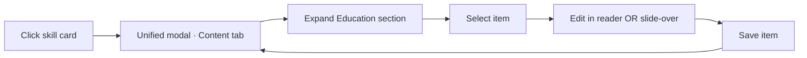
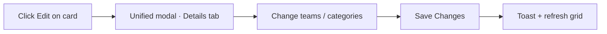
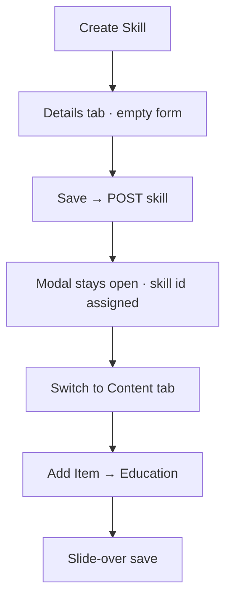
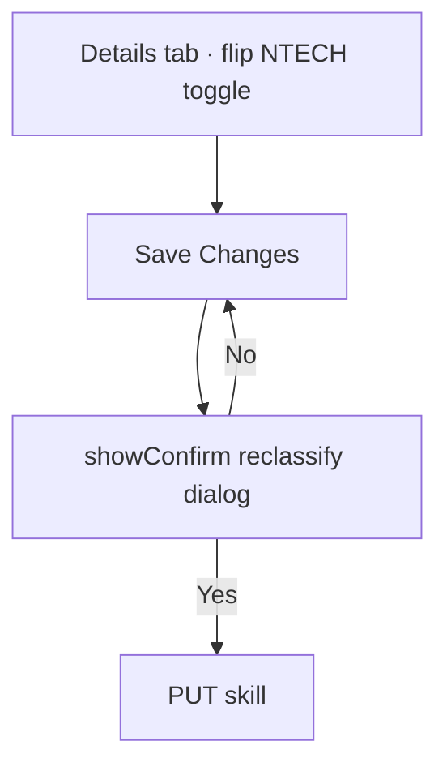

# Skill Catalog — Unified Editing Experience

**Status:** Phase 1 — Research & design (awaiting approval)  
**Interactive mockup:** `docs/design/skill-catalog-unified-editor-mockup.html`  
**Production today:** `frontend/js/pages/catalog.js` (`showSkillDetailModal`, `openSkillModal`, `showContentEditModal`)  
**Design reference:** My Plan skill modal — `frontend/js/pages/my-plan.js` (`openEditSkillModal`, `sdm-plan-modal`)

---

## Executive summary

Catalog skill management is split across **two primary modals** plus a **nested content-item editor**. Users must context-switch to fully manage a skill. The redesign consolidates everything into **one My Plan–style skill editor** with tabbed sections (Content · Details), a unified **Add Item** flow, and full window controls (maximize / restore / close)—while preserving **100% functional parity** with today’s implementation.

---

## Current-state workflow

### Entry points (catalog grid)

| Action | Who | Opens | Code |
|--------|-----|-------|------|
| Click skill card | All roles | Skill content modal (read + admin edit content) | `showSkillDetailModal` |
| **Edit** on card | Admin / manager | Skill attributes modal | `openSkillModal(skill)` |
| **Create Skill** | Admin / manager | Empty attributes modal | `openSkillModal(null)` |
| Archive / Restore | Admin / manager | Confirm → API | `handleArchiveSkill` |
| Delete | Admin | Typed confirm → cascade API | `handleCascadeDeleteSkill` |

> **Note:** Content modal opens on **single click**, not double-click (spec assumption differs from code).

### Modal 1 — Skill content (`showSkillDetailModal`)

Shell: `modal skill-detail-modal sdm-plan-modal catalog-skill-modal` (partial My Plan parity).

**Header (read-only metadata)**
- Skill icon, name, archived badge
- Description with show more/less
- Meta chips: Category, Teams (+ overflow), Certifications (click → filter catalog), Tags

**Main area (master–detail)**
- Left: **vertical 3E track** (`sdm-3e-track`) — same bubble/timeline layout as My Plan modal
- Drag-reorder items (admin/manager only)
- Footer: **Add Item** menu (manager/admin only)
- Right: item reader + Edit / Delete (manager/admin only); item editor uses full reader column with Quill

**Footer**
- Status hint, Close

**Missing vs My Plan modal**
- No maximize / restore
- No Save / Discard (content saves per-item immediately via nested modal)
- No inline attribute editing

### Modal 2 — Skill attributes (`openSkillModal` + `buildSkillForm`)

Shell: `showModal` + `modal-skill-edit` with sticky header/footer reparented into body.

**Sections**
1. **Identity** — Name*, Description, Tags (comma-separated)
2. **Classification** — Non-Technical toggle, Category multi-select chips
3. **Associations** — Teams (shift filter + combobox), NTECH shift checkboxes, Certificates combobox
4. **Visual** — Icon picker (collapsed/expandable)

**Save flows**
- Create → `POST /api/skills/`
- Edit → `PUT /api/skills/{id}` with reclassify typed confirm when NTECH toggle changes
- Validation: name required

### Modal 3 — Content item editor (`showContentEditModal`)

Stacked **above** Modal 1 (z-index 210+).

**Fields:** Title*, Type* (course | certification | reading | link | action), Description (Quill HTML), URL  
**Actions:** Cancel (unsaved confirm), Save → `POST/PUT /api/skills/{id}/content`  
**Delete:** From reader toolbar in Modal 1, not in item editor

---

## Pain points

| # | Issue | Impact |
|---|--------|--------|
| P1 | **Two modals for one skill** | Users open content modal, then must close and click Edit for name/teams/categories |
| P2 | **Metadata read-only in content modal** | Categories/teams/certs visible but not editable where users expect |
| P3 | **Modal stacking** | Content item editor stacks on content modal; easy to lose context |
| P4 | **Inconsistent shell** | Content modal lacks maximize; attributes modal uses different chrome |
| P5 | **Three add buttons** | Visual clutter; spec asks for single **Add Item** → type picker |
| P6 | **Create Skill isolated** | New skills created without seeing 3E content structure until second session |
| P7 | **No dirty-state on attributes** | Attributes save immediately on confirm; content saves per nested modal—mixed mental model |

---

## Functional parity matrix (must preserve)

### Skill attributes (`openSkillModal`)

| Capability | Create | Edit | Unified home |
|------------|--------|------|--------------|
| Name (required) | ✓ | ✓ | **Details** tab |
| Description | ✓ | ✓ | **Details** tab |
| Tags (comma-separated) | ✓ | ✓ | **Details** tab |
| Category multi-select | ✓ | ✓ | **Details** tab |
| Non-Technical toggle | ✓ | ✓ | **Details** tab |
| NTECH shift checkboxes | ✓ | ✓ | **Details** tab (when NTECH) |
| Teams combobox + shift filter | ✓ | ✓ | **Details** tab |
| Certificates combobox | ✓ | ✓ | **Details** tab |
| Icon picker | ✓ | ✓ | **Details** tab |
| Reclassify confirm | — | ✓ | **Details** tab save |
| Archive / Restore / Delete | card actions | card actions | **Keep on card** (destructive, out of editor) |

### Skill content (`showSkillDetailModal` + nested editor)

| Capability | Today | Unified home |
|------------|-------|--------------|
| View 3E track + reader | ✓ (all) | **Content** tab — `sdm-3e-track` vertical bubbles |
| Details tab | admin/manager | **Hidden for engineers** |
| Add Item | admin/manager | **Hidden for engineers** |
| Edit / delete items | admin/manager | Pending until **Save Details** |
| Edit attributes + icon | admin/manager | Pending until **Save Details** |
| Cert chip → catalog filter | ✓ | ✓ (read-only meta in header) |
| Archived badge | ✓ | ✓ |

### APIs (unchanged)

- `GET/POST/PUT/DELETE /api/skills/{id}/content`
- `GET/PUT/POST /api/skills/`, reclassify-preview, ntech-teams, cascade-preview/delete

---

## UX research & recommendations

### Patterns applied

| Pattern | Source | Application |
|---------|--------|-------------|
| **Master–detail + side panel** | My Plan `sdm-plan-modal` | Content tab reuses proven list + reader |
| **Tabbed large-object editor** | Figma, Jira, Azure Portal | Details vs Content; avoids scroll fatigue |
| **Progressive disclosure** | NN/g | Icon picker collapsed; NTECH panel only when toggle on |
| **Single primary action** | Enterprise CMS | One **Add Item** → type menu |
| **Slide-over for secondary edit** | GitHub, Linear | Content item form replaces stacked modal |
| **Window maximize** | My Plan | Full viewport for long 3E lists + Details form |
| **Explicit save bar** | My Plan footer | Details tab: Save / Discard with dirty indicator |

### Tradeoffs

| Option | Pros | Cons | Decision |
|--------|------|------|----------|
| Tabs (Content \| Details) | Clear separation, familiar | Two clicks to switch | **Recommended** |
| Single long scroll | One save for everything | 800+ px forms; poor content UX | Reject |
| Split pane (attrs left, content right) | Everything visible | Cramped at 1280px min viewport | Reject for default; optional in maximized |
| Inline content editing (no slide-over) | Fewer layers | Reader area crowded | Use slide-over within modal |

---

## Target experience — Unified Skill Editor

### Shell (aligned with My Plan)

```
┌──────────────────────────────────────────────────────────────────────────┐
│ [icon] Skill Name                              [Restore catalog] [□][×]   │
│ Description excerpt…  [Category chips] [Team chips] [Cert chips] [Tags]  │
│ ──────────────────────────────────────────────────────────────────────── │
│  Content  │  Details                                                    │
├──────────────────────────────────────────────────────────────────────────┤
│                                                                          │
│   (tab panel — see below)                                                │
│                                                                          │
├──────────────────────────────────────────────────────────────────────────┤
│  Status hint / dirty state          [Discard]  [Save Changes]  (Details) │
│  or "Select an item…" / Close only (Content)                             │
└──────────────────────────────────────────────────────────────────────────┘
```

**Window controls:** Maximize, Restore, Close — reuse `sdm-window-btn`, `modal-overlay--maximized`, `sdm-plan-modal--maximized` from My Plan.

**Open behavior**
- Card click → Unified editor, **Content** tab active (same as today’s primary action)
- Card **Edit** → Unified editor, **Details** tab active (replaces separate attributes modal)
- **Create Skill** → Unified editor, **Details** tab active, Content tab enabled after first save (skill id required)

### Content tab (default)

Identical interaction model to My Plan `sdm-3e-track`:
- Vertical bubble rail with connectors per section (Education / Exposure / Experience)
- Expand/collapse sections, item list under active section
- **Add Item** (manager/admin) → level picker popover

Item add/edit opens in the **reader column** (full width) with Quill rich text — not a stacked modal. **No per-item Save**; changes stay pending.

### Details tab (manager/admin only)

Embeds existing `buildSkillForm` sections including **Visual → icon picker**.

### Unified footer — Save Details / Discard Changes (My Plan parity)

**All** editable changes (content items, attributes, icon, associations) remain **pending** until the user clicks **Save Details**. Footer always shows:

| State | Status line | Actions |
|-------|-------------|---------|
| Clean | "No pending changes" | Discard Changes · Save Details |
| Dirty | "Pending changes — click Save Details to apply" | Discard Changes · Save Details |

**Discard Changes** reverts every pending modification (content + details) to last saved state.

Engineers see **Close** only — no Details tab, Add Item, or edit affordances.

### Footer modes (legacy note — superseded)

~~Content items save immediately on slide-over Save~~ — **replaced** by unified pending state + Save Details.

---

## User flows

### Flow A — Edit content item (admin)



### Flow B — Edit skill metadata (admin)



### Flow C — Create skill + add content



### Flow D — Nested confirm (reclassify)



Confirm dialogs remain **system modals** above unified editor (existing `showConfirm` z-index 210).

---

## Wireframes

### Default view (Content tab)

```
┌─────────────────────────────────────────────────────────────┐
│ ▣ BGP Troubleshooting                    [□ maximize] [×]   │
│ Advanced routing diagnostics for enterprise…                │
│ [Advanced] [TAC-ENT-ROUT-S1] [CCNP ENCOR] [bgp, escalation]  │
│ ┌──────────┬──────────────────────────────────────────────┐ │
│ │ Content  │  Details                                     │ │
│ └──────────┴──────────────────────────────────────────────┘ │
│ ┌ List ──────────────┐ ┌ Reader ─────────────────────────┐ │
│ │ − Education     3  │ │ [Edit] [Delete]    course · L1  │ │
│ │   · Item A         │ │ Title                           │ │
│ │   · Item B         │ │ Description prose…              │ │
│ │ + Exposure      2  │ │ Open resource →                 │ │
│ │ + Experience    1  │ │                                 │ │
│ └────────────────────┘ └─────────────────────────────────┘ │
│ [+ Add Item ▾]                                               │
│ ─────────────────────────────────────────────────────────── │
│ Expand a section and select an item          [Close]        │
└─────────────────────────────────────────────────────────────┘
```

### Maximized view

- Overlay: `modal-overlay--maximized`
- Modal: ~96vw × ~92vh
- List column width 320px fixed; reader flexes
- Details tab: two-column assoc grid at ≥1400px (reuse `skill-edit-row--assoc`)

### Add Item picker

```
                    [+ Add Item ▾]
                           │
              ┌────────────┼────────────┐
              ▼            ▼            ▼
         Education     Exposure    Experience
              │            │            │
              └────────────┴────────────┘
                           │
                           ▼
                  Content slide-over opens
```

### Content slide-over (replaces Modal 3)

```
┌──────────────────────────────┐
│ Add Content Item        [×]  │
│ Level: Education (fixed)     │
│ Title *                      │
│ Type *                       │
│ Description (Quill)          │
│ URL                          │
│ [Cancel]  [Add Item]         │
└──────────────────────────────┘
```

### Details tab

```
┌─────────────────────────────────────────────────────────────┐
│ … header + tabs …                                           │
│ IDENTITY                                                    │
│   Name *    [________________________]                      │
│   Description [textarea]                                    │
│   Tags      [________________________]                      │
│ CLASSIFICATION                                              │
│   [○ Non-Technical]  [Foundational][Core][Advanced][AI]…    │
│ ASSOCIATIONS                                                │
│   Teams (shift filter + combobox) │ Certificates (combo)    │
│ VISUAL                                                      │
│   [icon preview] Change…                                    │
│ ─────────────────────────────────────────────────────────── │
│ Unsaved changes              [Discard] [Save Changes]       │
└─────────────────────────────────────────────────────────────┘
```

### Validation & error states

| State | Behavior |
|-------|----------|
| Name empty on Details save | Inline toast + focus `#skill-name` (today: toast only) |
| API 4xx on save | Toast + keep modal open + footer dirty state |
| Unsaved Details on tab switch | Confirm: "Discard unsaved changes?" |
| Unsaved slide-over on close | Same confirm as today (`hasUnsavedChanges`) |
| Content load failure | Skeleton → empty-state in list column (today) |

---

## Component reuse plan (Phase 2)

| Piece | Source | Action |
|-------|--------|--------|
| Modal shell + maximize | `my-plan.js` `setModalMaximized` | Extract to `components/skill-detail-shell.js` |
| 3E tree + reader | `catalog.js` `showSkillDetailModal` | Extract `renderCatalogContentPanel()` |
| Attributes form | `catalog.js` `buildSkillForm` | Unchanged; mount in Details tab |
| Content item form | `showContentEditModal` | Convert to slide-over component |
| CSS | `sdm-plan-modal`, `skill-edit-*`, `catalog-skill-*` | Merge under `.catalog-unified-modal` |

**Estimated touch:** `catalog.js` (primary), new `components/catalog-skill-editor.js`, `style.css` (~200 lines), no backend changes.

---

## Accessibility

- `role="dialog"` + `aria-modal="true"` on shell
- Tab list: `role="tablist"` / `tab` / `tabpanel` for Content | Details
- Add Item menu: keyboard navigable listbox; Escape closes
- Focus trap in slide-over when open; return focus to Add Item on close
- Maximize: `aria-label` toggle Restore / Maximize (My Plan pattern)
- Drag handles: `aria-grabbed` during reorder

---

## Success criteria (from spec)

| Criterion | How measured |
|-----------|--------------|
| 100% functional parity | Parity matrix signed off |
| Fewer modal transitions | 2 modals → 1 (+ optional slide-over, no full overlay stack) |
| My Plan visual consistency | Shared `sdm-plan-modal` shell + window controls |
| Minimal retraining | Content tab matches current content modal |
| Scalable | Tab model allows future "History" or "Audit" tab |

---

## Phase 2 implementation checklist (after approval)

- [ ] Extract shared skill modal shell from My Plan
- [ ] Implement `openCatalogSkillEditor(skill, { tab, mode })`
- [ ] Wire card click → Content tab; Edit → Details tab; Create → Details
- [ ] Replace 3 add buttons with Add Item menu
- [ ] Replace `showContentEditModal` overlay with slide-over
- [ ] Add Details dirty-state + tab-switch guard
- [ ] Add maximize to catalog editor
- [ ] Remove `openSkillModal` / standalone `showSkillDetailModal` entry points
- [ ] Manual QA: all parity matrix rows
- [ ] Bump `catalog.js` + `style.css` cache versions

---

## Approval

| Reviewer | Date | Decision |
|----------|------|----------|
| Product / UX | | ☐ Approve ☐ Revise |
| Engineering | | ☐ Approve ☐ Revise |

**Next step:** Review mockup HTML, approve design, then proceed to Phase 2 implementation.
